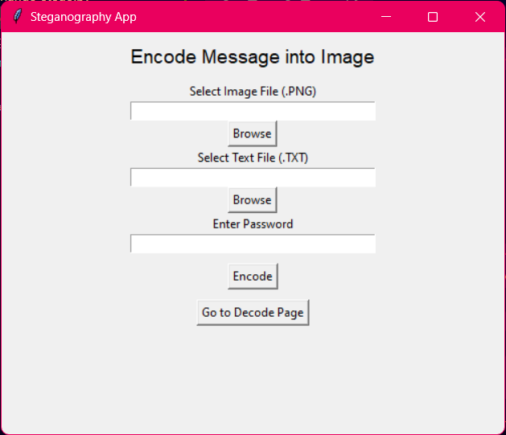

# AICTE Steganography Project

This project provides a CLI and GUI-based steganography system to encode and decode hidden messages within images using different techniques.

## This is the GUI for embedding a text file into image

## This is the GUI for decrypting a text file from image

## Files and Functionalities:

### 1. **cli_rgb_change_stego.py**  
   - A command-line tool for encoding and decoding messages within an image.
   - The message is stored in the RGB values of the pixels.
   - Requires a password to retrieve the hidden message.
   - Outputs an encrypted image file.

### 2. **gui_rgb_change_stego.py**  
   - A GUI-based version of `cli_rgb_change_stego.py` using Tkinter.
   - Allows users to select an image, enter a secret message, and encode it.
   - Supports decoding the message with a password.
   - Provides an interactive interface for usability.

### 3. **gui_stego_lib.py**  
   - An advanced GUI-based steganography tool utilizing the `stegano` library.
   - Uses LSB (Least Significant Bit) steganography for embedding messages in PNG images.
   - Supports encoding messages from a text file into an image.
   - Secure decryption of messages with password authentication.
   - Extracted messages are saved to a text file.

### 4. **mypic.png**  
   - Sample image used for testing the steganography encoding and decoding process.

### 5. **secret.txt**  
   - Sample text file containing secret messages to be embedded into images.

## Usage:
- Use `cli_rgb_change_stego.py` for a simple command-line interface.
- Use `gui_rgb_change_stego.py` for a user-friendly GUI.
- Use `gui_stego_lib.py` for enhanced security with LSB steganography.

